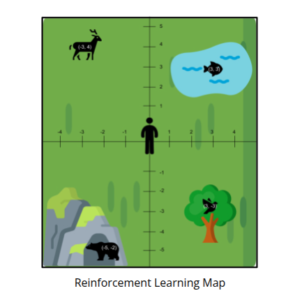

# Exercise 1: Animal Habitat

This problem is designed to help you understand the basic components of reinforcement learning from a real-world perspective.

> **Reinforcement Learning Map**
> Graph with person at center. Bear at (-5, -2), bird at (3, -3), fish at (3, 3), and deer at (-3, 4).

## Scenario Definition

Below we have depicted a reinforcement learning environment. There is one human who is trying to survive in the environment. The goal of the human in this environment is to find food and avoid predators. There are three food sources in the environment — the deer, the fish, and the bird. There is one predator in the environment — the bear.

## Relevant Assumptions

- The human can move one step at a time.
- The food and predator cannot move.
- The tree and lake are not obstacles — the human can “walk through” them to reach the food sources.

## Objective

Your task is to identify the main reinforcement learning components for the scenario defined above.

### Agent

Who is the agent in this scenario?

The human.

### State Representation

- What information needs to be included in the state for the agent to make informed decisions?
- Describe the components of the state.

1. Current Position [(x, y) coordinates] of the agent
2. Food locations: (-3, 4), (3, 3), (-3, 3)
3. Predator locations: (-5, -2)

### Action Space

List the possible actions the agent can take in the environment.

1. Step one unit up
2. Step one unit down
3. Step one unit left
4. Step one unit right

### Reward

- Define the rewards that will guide the agent’s behavior.
- Specify the rewards for finding food, being caught by a predator, and any other relevant events.

1. Some positive reward for finding food
2. e.g., +10 points when agent position = (-3, 4), or (3, 3), or (-3, 3)
3. Some negative reward for finding predator
4. e.g., -10 points when agent position = (-5, -2)
