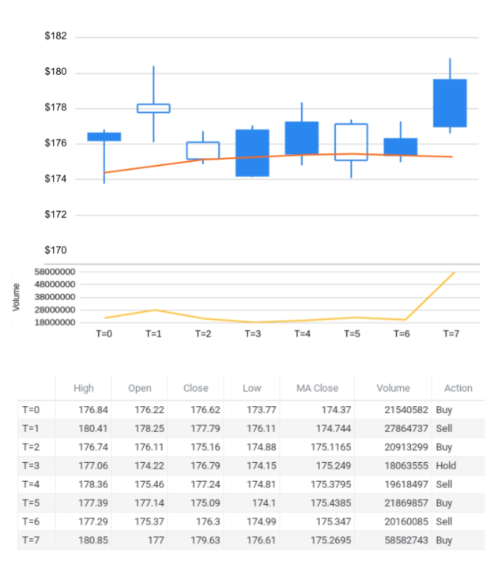

# Exercise 2: RL Components in Finance

> This problem is designed to help you understand the basic components of reinforcement learning from a financial perspective.

---

## Scenario

**Scenario Definition:** Above, we depict a simple learning environment for financial reinforcement. Imagine there is a trading bot who is trying to make a profit by trading this stock. We want to use three sources of information in this environment - the stock close price, the 20-day moving average of the stock close price, and the volume of stocks being traded.

**Objective:** Your task is to identify the main reinforcement learning components for the above-case scenario.

---

## RL Components

### 1. Agent

> Who is the agent in this scenario?

The trading bot.

---

### 2. State Representation

> What information could be included in the state for the agent to make informed decisions? Describe the components of the state.

1. The stock close price.
2. The 20-day moving average of the closing price.
3. The volume of the stocks being traded.

---

### 3. Action Space

> List the possible actions the agent can take in the environment.

1. Buy more positions of that stock.
2. Sell positions of that stock.
3. Hold the positions of that stock.

---

### 4. Reward

> Define the rewards that will guide the agent's behavior. Specify the rewards for each action.

1. Buy stock - zero
2. Hold stock - zero
3. Sell stock - profit
