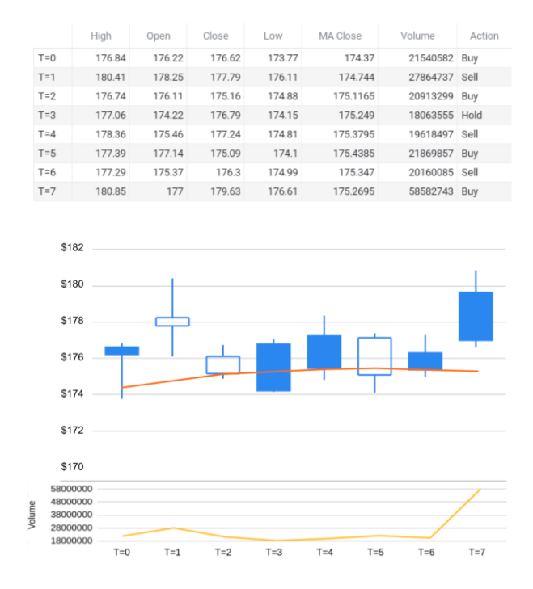

# Exercise 4: Manual Training Steps

This problem is designed to help you understand the reinforcement learning process from a financial perspective.

## Scenario Definition

Above we have depicted a reinforcement learning environment. Imagine there is a trading bot who is trying to make a profit by trading this stock. We want to use three sources of information in this environment:

- The stock **close price**
- The **20-day moving average** of the stock close price
- The **volume** of stocks being traded

Values for these variables are provided for specific time steps below.

## Objective

For time steps 0 to 6, define the **state**, **action**, **next state**, and **reward**, utilizing the definitions from Exercise 2.

> **Hint:** The format of the state representation vector should be `[close price, moving average, volume]`.

---

## Raw Data

| Time Step | High   | Open   | Close  | Low    | MA Close | Volume   | Action |
| --------- | ------ | ------ | ------ | ------ | -------- | -------- | ------ |
| T=0       | 176.84 | 176.22 | 176.62 | 173.77 | 174.37   | 21540582 | Buy    |
| T=1       | 180.41 | 178.25 | 177.79 | 176.11 | 174.744  | 27864737 | Sell   |
| T=2       | 176.74 | 176.11 | 175.16 | 174.88 | 175.1165 | 20913299 | Buy    |
| T=3       | 177.06 | 174.22 | 176.79 | 174.15 | 175.249  | 18063555 | Hold   |
| T=4       | 178.36 | 175.46 | 177.24 | 174.81 | 175.3795 | 19618497 | Sell   |
| T=5       | 177.39 | 177.14 | 175.09 | 174.1  | 175.4385 | 21869857 | Buy    |
| T=6       | 177.29 | 175.37 | 176.3  | 174.99 | 175.347  | 20160085 | Sell   |
| T=7       | 180.85 | 177.00 | 179.63 | 176.61 | 175.2695 | 58582743 | Buy    |

---

## Training Steps

| Time Step | State                        | Action | Next State                   | Reward | Profit |
| --------- | ---------------------------- | ------ | ---------------------------- | ------ | ------ |
| T=0       | [176.62, 174.37, 21540582]   | Buy    | [177.79, 174.744, 27864737]  | 0      | 0      |
| T=1       | [177.79, 174.744, 27864737]  | Sell   | [175.16, 175.1165, 20913299] | +1.17  | +1.17  |
| T=2       | [175.16, 175.1165, 20913299] | Buy    | [176.79, 175.249, 18063555]  | 0      | 0      |
| T=3       | [176.79, 175.249, 18063555]  | Hold   | [177.24, 175.3795, 19618497] | 0      | 0      |
| T=4       | [177.24, 175.3795, 19618497] | Sell   | [175.09, 175.4385, 21869857] | +2.08  | +2.08  |
| T=5       | [175.09, 175.4385, 21869857] | Buy    | [176.3, 175.347, 20160085]   | 0      | 0      |
| T=6       | [176.3, 175.347, 20160085]   | Sell   | [179.63, 175.2695, 58582743] | +1.21  | +1.21  |
